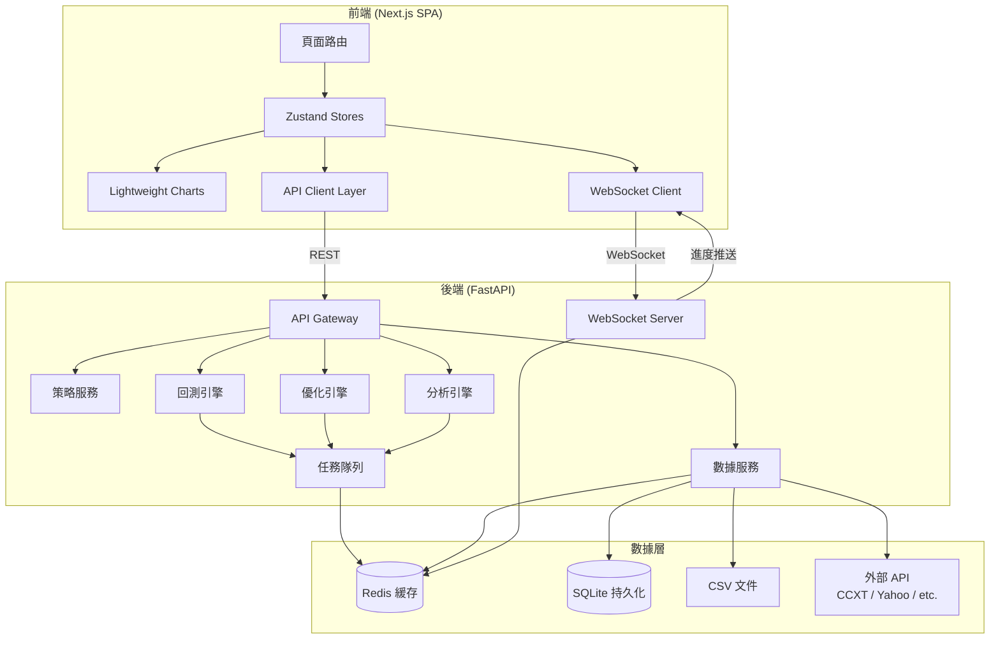
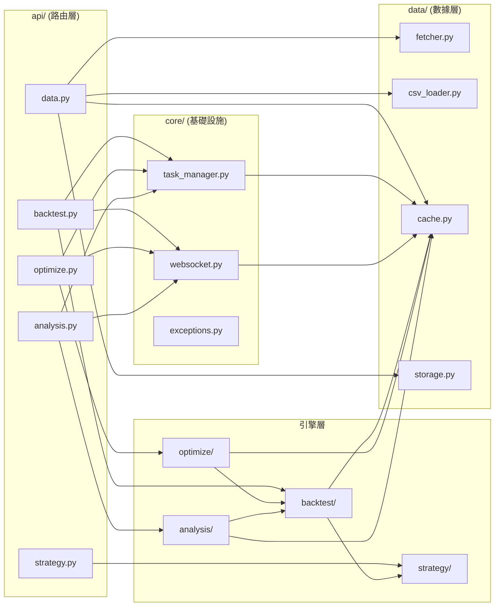
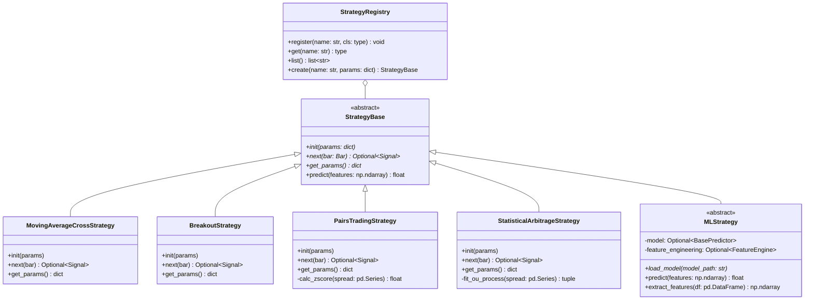
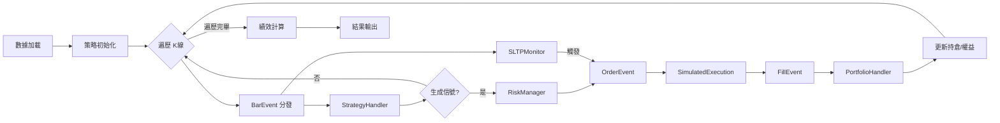
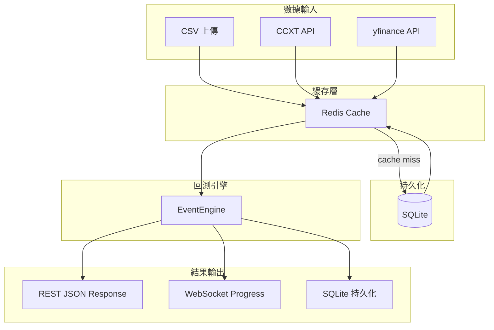
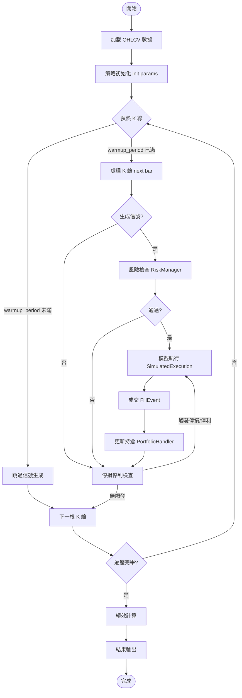
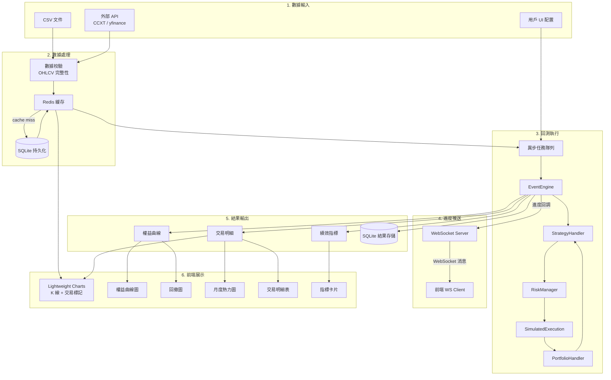
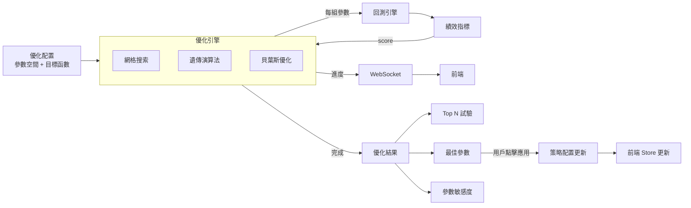
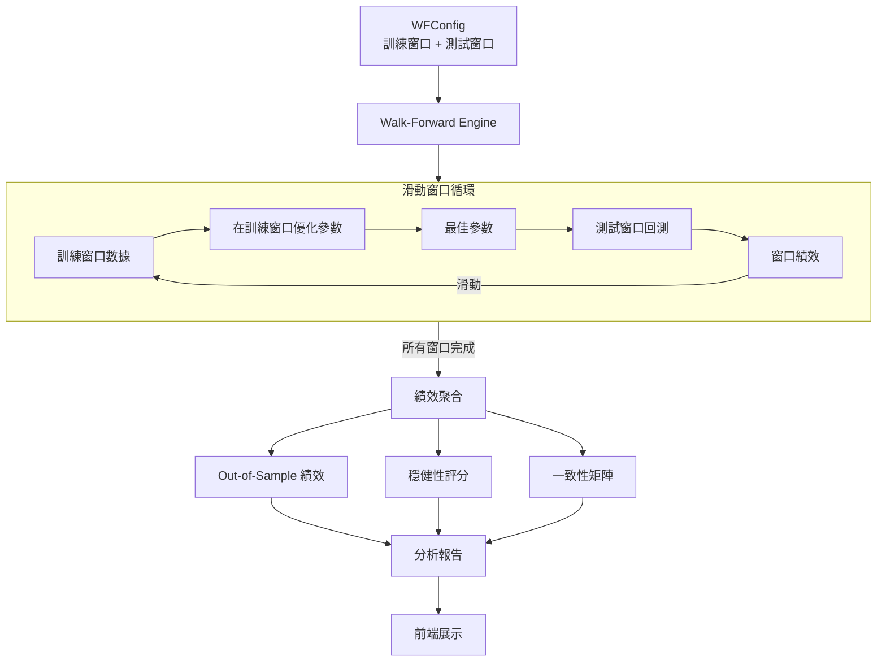

# 量化回測平台 — 系統架構設計文檔

> **提示詞**：PROMPT_01_SYSTEM_ARCHITECT
> **角色**：資深量化交易系統架構師
> **技術棧**：Next.js + TypeScript + Tailwind / FastAPI + Python
> **設計原則**：極簡美學（impeccable.style）、模組化、高性能解耦、ML 預留

---

## 目錄

1. [系統架構總覽](#1-系統架構總覽)
2. [前端架構](#2-前端架構)
3. [後端架構](#3-後端架構)
4. [前後端通信](#4-前後端通信)
5. [數據模型設計](#5-數據模型設計)
6. [API 端點設計](#6-api-端點設計)
7. [策略引擎類層次結構](#7-策略引擎類層次結構)
8. [回測引擎工作流程](#8-回測引擎工作流程)
9. [圖表數據接口設計](#9-圖表數據接口設計)
10. [數據流圖](#10-數據流圖)

---

## 1. 系統架構總覽

### 1.1 高層架構圖



### 1.2 設計決策摘要

| 決策 | 選擇 | 理由 |
|------|------|------|
| 前端框架 | Next.js (SPA export) | SSR 不需要，SPA 模式部署簡單 |
| 狀態管理 | Zustand | 輕量、無 boilerplate、TypeScript 友好 |
| 圖表庫 | Lightweight Charts | TradingView 同源，專業 K 線互動 |
| 後端框架 | FastAPI | 原生 async、自動 OpenAPI、Pydantic 整合 |
| 任務隊列 | Redis + asyncio TaskGroup | 回測/優化為長任務，需異步執行 + 進度推送 |
| 持久化 | SQLite | 極簡、零運維、未來可平滑遷移 PostgreSQL |
| ML 預留 | StrategyBase.predict() | 抽象方法，未來接 model.predict() |

---

## 2. 前端架構

### 2.1 目錄結構

```
frontend/
├── public/
│   └── favicon.ico
├── src/
│   ├── app/                          # Next.js App Router
│   │   ├── layout.tsx                # 根佈局（主題注入、全局 Provider）
│   │   ├── page.tsx                  # 首頁 → 重定向至 /backtest
│   │   ├── backtest/
│   │   │   └── page.tsx              # 回測主頁（策略配置 + 圖表 + 結果）
│   │   ├── optimize/
│   │   │   └── page.tsx              # 參數優化頁
│   │   ├── analysis/
│   │   │   └── page.tsx              # Walk-Forward / 蒙地卡羅分析頁
│   │   ├── data/
│   │   │   └── page.tsx              # 數據管理頁（導入 / 抓取）
│   │   └── settings/
│   │       └── page.tsx              # 全局設定頁
│   ├── components/
│   │   ├── charts/
│   │   │   ├── CandlestickChart.tsx  # K 線主圖（Lightweight Charts）
│   │   │   ├── EquityCurve.tsx       # 權益曲線
│   │   │   ├── DrawdownChart.tsx     # 回撤曲線
│   │   │   └── MonthlyHeatmap.tsx    # 月度報酬熱力圖
│   │   ├── strategy/
│   │   │   ├── StrategySelector.tsx  # 策略模板下拉
│   │   │   ├── ParamEditor.tsx       # 參數編輯器（動態渲染）
│   │   │   └── StrategyCodeEditor.tsx # 自訂策略代碼編輯器
│   │   ├── backtest/
│   │   │   ├── BacktestConfig.tsx    # 回測配置面板
│   │   │   ├── ResultsPanel.tsx      # 結果摘要 + 指標卡片
│   │   │   └── TradeTable.tsx        # 交易明細表
│   │   ├── optimize/
│   │   │   ├── ParamSpaceEditor.tsx  # 參數空間定義
│   │   │   └── OptimizeResults.tsx   # 優化結果視覺化
│   │   └── ui/                       # 基礎 UI 組件（無邊框、impeccable 風格）
│   │       ├── Card.tsx
│   │       ├── Button.tsx
│   │       ├── Select.tsx
│   │       ├── Input.tsx
│   │       ├── Tabs.tsx
│   │       └── Spinner.tsx
│   ├── stores/                       # Zustand stores
│   │   ├── useBacktestStore.ts       # 回測狀態
│   │   ├── useStrategyStore.ts       # 策略配置狀態
│   │   ├── useDataStore.ts           # 數據狀態
│   │   ├── useOptimizeStore.ts       # 優化狀態
│   │   └── useSettingsStore.ts       # 全局設定（主題、API endpoint）
│   ├── lib/
│   │   ├── api.ts                    # REST API client（fetch 包裝）
│   │   ├── websocket.ts              # WebSocket client（進度訂閱）
│   │   └── format.ts                 # 數字 / 日期格式化工具
│   ├── types/                        # TypeScript interfaces（與後端 Pydantic 對齊）
│   │   ├── market.ts
│   │   ├── strategy.ts
│   │   ├── backtest.ts
│   │   ├── optimize.ts
│   │   └── analysis.ts
│   ├── hooks/
│   │   ├── useBacktest.ts            # 回測生命周期 hook
│   │   ├── useOptimize.ts            # 優化生命周期 hook
│   │   └── useWebSocket.ts           # WS 連線管理 hook
│   └── styles/
│       └── globals.css               # Tailwind + impeccable 主題變數
├── next.config.js
├── tailwind.config.ts
├── tsconfig.json
└── package.json
```

### 2.2 頁面路由設計

| 路由 | 頁面 | 核心功能 |
|------|------|----------|
| `/` | 首頁 | 重定向至 `/backtest` |
| `/backtest` | 回測主頁 | 策略選擇 → 參數配置 → 數據選擇 → 執行回測 → 結果展示 |
| `/optimize` | 參數優化 | 定義參數空間 → 選擇優化算法 → 執行 → 結果排名 |
| `/analysis` | 分析驗證 | Walk-Forward / 蒙地卡羅 → 穩健性報告 |
| `/data` | 數據管理 | CSV 上傳 / API 抓取 / 標的列表 |
| `/settings` | 全局設定 | 主題切換 / API 端點 / 風險參數默認值 |

### 2.3 Zustand Store 設計

```typescript
// ── useBacktestStore ──
interface BacktestState {
  config: BacktestConfig;          // 當前回測配置
  status: 'idle' | 'running' | 'done' | 'error';
  progress: number;                // 0-100
  results: BacktestResult | null;  // 回測結果
  error: string | null;
  // actions
  setConfig: (cfg: Partial<BacktestConfig>) => void;
  runBacktest: () => Promise<void>;
  reset: () => void;
}

// ── useStrategyStore ──
interface StrategyState {
  templates: StrategyTemplate[];   // 可用策略模板
  selectedTemplate: string | null; // 當前選中模板 ID
  params: Record<string, any>;     // 當前參數值
  customCode: string | null;       // 自訂策略代碼
  validationErrors: string[];
  // actions
  loadTemplates: () => Promise<void>;
  selectTemplate: (id: string) => void;
  setParam: (key: string, value: any) => void;
  validate: () => Promise<boolean>;
}

// ── useDataStore ──
interface DataState {
  symbols: SymbolInfo[];           // 可用標的列表
  selectedSymbol: string | null;
  timeframe: string;               // '1m' | '5m' | '1h' | '1d' ...
  dateRange: [string, string];     // ISO 日期
  ohlcv: ChartData[] | null;       // 當前加載的 K 線數據
  loading: boolean;
  // actions
  loadSymbols: () => Promise<void>;
  loadOHLCV: (symbol: string, tf: string, from: string, to: string) => Promise<void>;
  importCSV: (file: File) => Promise<void>;
}

// ── useOptimizeStore ──
interface OptimizeState {
  paramSpace: ParamSpaceConfig;    // 參數空間定義
  algorithm: 'grid' | 'genetic' | 'bayesian';
  objective: ObjectiveConfig;      // 目標函數配置
  status: 'idle' | 'running' | 'done' | 'error';
  progress: number;
  results: OptimizeResult | null;
  // actions
  setParamSpace: (ps: Partial<ParamSpaceConfig>) => void;
  setAlgorithm: (algo: string) => void;
  runOptimize: () => Promise<void>;
  applyBestParams: () => Promise<void>;
}

// ── useSettingsStore ──
interface SettingsState {
  theme: 'light' | 'dark' | 'auto';
  apiBaseUrl: string;
  wsBaseUrl: string;
  defaultCapital: number;
  defaultCommission: number;
  defaultSlippage: number;
  // actions
  setTheme: (t: string) => void;
  update: (s: Partial<SettingsState>) => void;
}
```

### 2.4 API 調用層設計

```typescript
// lib/api.ts — REST API client
const BASE = process.env.NEXT_PUBLIC_API_BASE ?? '/api';

async function request<T>(
  path: string,
  opts?: RequestInit & { params?: Record<string, string> }
): Promise<T> {
  const url = new URL(`${BASE}${path}`);
  if (opts?.params) {
    Object.entries(opts.params).forEach(([k, v]) => url.searchParams.set(k, v));
  }
  const res = await fetch(url.toString(), {
    headers: { 'Content-Type': 'application/json', ...opts?.headers },
    ...opts,
  });
  if (!res.ok) throw new ApiError(res.status, await res.text());
  return res.json();
}

export const api = {
  // Data
  importCSV: (file: File) => { /* FormData upload */ },
  getSymbols: () => request<SymbolInfo[]>('/data/symbols'),
  getOHLCV: (params: OHLCVQuery) => request<ChartData[]>('/data/ohlcv', { params }),

  // Strategy
  getTemplates: () => request<StrategyTemplate[]>('/strategy/templates'),
  validateStrategy: (cfg: StrategyConfig) => request<ValidationResult>('/strategy/validate', { method: 'POST', body: JSON.stringify(cfg) }),

  // Backtest
  runBacktest: (cfg: BacktestConfig) => request<{ task_id: string }>('/backtest/run', { method: 'POST', body: JSON.stringify(cfg) }),
  getBacktestStatus: (id: string) => request<BacktestStatus>(`/backtest/status/${id}`),
  getBacktestResults: (id: string) => request<BacktestResult>(`/backtest/results/${id}`),

  // Optimize
  runOptimize: (cfg: OptimizeConfig) => request<{ task_id: string }>('/optimize/run', { method: 'POST', body: JSON.stringify(cfg) }),
  getOptimizeResults: (id: string) => request<OptimizeResult>(`/optimize/results/${id}`),
  applyBestParams: (params: Record<string, any>) => request('/optimize/best-params', { method: 'POST', body: JSON.stringify(params) }),

  // Analysis
  runWalkForward: (cfg: WFConfig) => request<{ task_id: string }>('/analysis/walk-forward', { method: 'POST', body: JSON.stringify(cfg) }),
  runMonteCarlo: (cfg: MCConfig) => request<{ task_id: string }>('/analysis/monte-carlo', { method: 'POST', body: JSON.stringify(cfg) }),
  getAnalysisResults: (id: string) => request<AnalysisResult>(`/analysis/results/${id}`),
};
```

---

## 3. 後端架構

### 3.1 FastAPI 目錄結構

```
backend/
├── app/
│   ├── main.py                     # FastAPI 應用入口 + CORS + 路由掛載
│   ├── config.py                   # 環境配置（Pydantic Settings）
│   ├── api/                        # API 路由層
│   │   ├── __init__.py
│   │   ├── router.py               # 總路由聚合
│   │   ├── data.py                 # /api/data/*
│   │   ├── strategy.py             # /api/strategy/*
│   │   ├── backtest.py             # /api/backtest/*
│   │   ├── optimize.py             # /api/optimize/*
│   │   └── analysis.py             # /api/analysis/*
│   ├── models/                     # Pydantic 數據模型
│   │   ├── __init__.py
│   │   ├── market.py               # 市場數據模型
│   │   ├── strategy.py             # 策略配置模型
│   │   ├── backtest.py             # 回測結果模型
│   │   ├── optimize.py             # 優化配置模型
│   │   └── analysis.py             # 分析結果模型
│   ├── strategy/                   # 策略引擎
│   │   ├── __init__.py
│   │   ├── base.py                 # StrategyBase 抽象基類
│   │   ├── registry.py             # 策略註冊表（動態掛載）
│   │   ├── ma_cross.py             # 均線交叉策略
│   │   ├── breakout.py             # 突破策略
│   │   ├── pairs_trading.py        # 配對交易策略
│   │   ├── stat_arb.py             # 統計套利策略
│   │   └── ml_strategy.py          # ML 策略預留接口（stub）
│   ├── backtest/                   # 回測引擎
│   │   ├── __init__.py
│   │   ├── engine.py               # 事件驅動回測引擎
│   │   ├── events.py               # 事件類型定義
│   │   ├── handlers/               # 事件處理器
│   │   │   ├── __init__.py
│   │   │   ├── strategy_handler.py
│   │   │   ├── risk_manager.py
│   │   │   ├── execution.py        # 模擬執行
│   │   │   ├── portfolio.py        # 持倉管理
│   │   │   └── sltp_monitor.py     # 停損停利監控
│   │   └── vectorized.py           # 向量化快速回測（可選）
│   ├── optimize/                   # 優化引擎
│   │   ├── __init__.py
│   │   ├── base.py                 # OptimizerBase
│   │   ├── grid_search.py          # 網格搜索
│   │   ├── genetic.py              # 遺傳演算法
│   │   ├── bayesian.py             # 貝葉斯優化（Optuna）
│   │   └── objective.py            # 目標函數構建器
│   ├── analysis/                   # 分析模組
│   │   ├── __init__.py
│   │   ├── walk_forward.py         # Walk-Forward 驗證
│   │   ├── monte_carlo.py          # 蒙地卡羅模擬
│   │   └── metrics.py              # 績效指標計算
│   ├── data/                       # 數據服務
│   │   ├── __init__.py
│   │   ├── fetcher.py              # 外部 API 抓取（CCXT / yfinance）
│   │   ├── csv_loader.py           # CSV 導入
│   │   ├── cache.py                # Redis 緩存層
│   │   └── storage.py              # SQLite 持久化
│   ├── core/                       # 核心基礎設施
│   │   ├── __init__.py
│   │   ├── task_manager.py         # 異步任務管理（TaskGroup + Redis）
│   │   ├── websocket.py            # WebSocket 進度推送
│   │   └── exceptions.py           # 自定義異常
│   └── db/
│       ├── __init__.py
│       ├── database.py             # SQLite 連線管理
│       └── schema.sql              # 表結構定義
├── requirements.txt
├── pyproject.toml
└── Dockerfile
```

### 3.2 模組劃分



### 3.3 策略引擎類層次結構



### 3.4 回測引擎工作流程



### 3.5 數據流設計



---

## 4. 前後端通信

### 4.1 REST API 端點設計

| 方法 | 端點 | 請求 Body | 響應 | 說明 |
|------|------|-----------|------|------|
| POST | `/api/data/import` | `multipart/form-data` | `{ symbol_id: str }` | 導入 CSV |
| GET | `/api/data/symbols` | — | `SymbolInfo[]` | 獲取標的列表 |
| GET | `/api/data/ohlcv` | `?symbol&timeframe&from&to` | `ChartData[]` | 獲取 K 線數據 |
| GET | `/api/strategy/templates` | — | `StrategyTemplate[]` | 獲取策略模板 |
| POST | `/api/strategy/validate` | `StrategyConfig` | `ValidationResult` | 驗證策略配置 |
| GET | `/api/strategy/config` | `?template_id` | `ParamSpec[]` | 獲取參數定義 |
| POST | `/api/backtest/run` | `BacktestConfig` | `{ task_id: str }` | 啟動回測（異步） |
| GET | `/api/backtest/status/{id}` | — | `BacktestStatus` | 查詢進度 |
| GET | `/api/backtest/results/{id}` | — | `BacktestResult` | 獲取結果 |
| POST | `/api/optimize/run` | `OptimizeConfig` | `{ task_id: str }` | 啟動優化（異步） |
| GET | `/api/optimize/results/{id}` | — | `OptimizeResult` | 獲取優化結果 |
| POST | `/api/optimize/best-params` | `{ params: dict }` | `{ applied: bool }` | 應用最佳參數 |
| POST | `/api/analysis/walk-forward` | `WFConfig` | `{ task_id: str }` | Walk-Forward 分析 |
| POST | `/api/analysis/monte-carlo` | `MCConfig` | `{ task_id: str }` | 蒙地卡羅模擬 |
| GET | `/api/analysis/results/{id}` | — | `AnalysisResult` | 獲取分析結果 |

### 4.2 WebSocket 通信

```
ws://host/ws/tasks/{task_id}
```

**服務端 → 客戶端消息格式**：

```json
{
  "type": "progress",
  "task_id": "bt_abc123",
  "progress": 45.2,
  "current_bar": 4520,
  "total_bars": 10000,
  "message": "Processing bar 4520/10000..."
}
```

```json
{
  "type": "complete",
  "task_id": "bt_abc123",
  "progress": 100,
  "result_ref": "/api/backtest/results/bt_abc123"
}
```

```json
{
  "type": "error",
  "task_id": "bt_abc123",
  "error": "Insufficient data: need >= 200 bars, got 150"
}
```

**優化進度（增量推送）**：

```json
{
  "type": "optimize_progress",
  "task_id": "opt_xyz789",
  "trial": 42,
  "total_trials": 200,
  "best_score": 1.85,
  "best_params": { "fast_period": 12, "slow_period": 26 }
}
```

### 4.3 請求/響應格式規範

- **所有 JSON 響應** 使用 `camelCase` 鍵名（前端友好）
- **時間戳** 統一使用 Unix timestamp（秒級整數）
- **金額** 使用浮點數，精度由前端格式化
- **錯誤響應** 統一格式：

```json
{
  "error": {
    "code": "VALIDATION_ERROR",
    "message": "Invalid parameter: fast_period must be > 0",
    "details": { "field": "fast_period", "value": -1 }
  }
}
```

---

## 5. 數據模型設計

### 5.1 市場數據模型

```python
# backend/app/models/market.py
from pydantic import BaseModel, Field, validator
from typing import Optional
from enum import Enum


class MarketType(str, Enum):
    CRYPTO = "crypto"
    STOCK = "stock"
    FUTURES = "futures"
    FOREX = "forex"


class Timeframe(str, Enum):
    M1 = "1m"
    M5 = "5m"
    M15 = "15m"
    M30 = "30m"
    H1 = "1h"
    H4 = "4h"
    D1 = "1d"
    W1 = "1w"


class SymbolInfo(BaseModel):
    symbol: str                           # "BTC/USDT", "AAPL", "ES"
    market: MarketType
    exchange: Optional[str] = None        # "binance", "nasdaq"
    base_asset: Optional[str] = None      # "BTC"
    quote_asset: Optional[str] = None     # "USDT"
    description: Optional[str] = None
    tick_size: Optional[float] = None
    lot_size: Optional[float] = None


class OHLCV(BaseModel):
    """單根 K 線數據"""
    timestamp: int                        # Unix timestamp (秒)
    open: float
    high: float
    low: float
    close: float
    volume: float

    @validator('high')
    def high_ge_open_low(cls, v, values):
        if 'open' in values and v < values['open']:
            raise ValueError('high must be >= open')
        if 'low' in values and v < values['low']:
            raise ValueError('high must be >= low')
        return v

    @validator('low')
    def low_le_open_high(cls, v, values):
        if 'open' in values and v > values['open']:
            raise ValueError('low must be <= open')
        return v

    @validator('volume')
    def volume_non_negative(cls, v):
        if v < 0:
            raise ValueError('volume must be non-negative')
        return v


class OrderBookLevel(BaseModel):
    """訂單簿單層"""
    price: float
    amount: float


class OrderBook(BaseModel):
    """訂單簿快照（可選）"""
    timestamp: int
    bids: list[OrderBookLevel]
    asks: list[OrderBookLevel]
```

**對應 TypeScript Interface**：

```typescript
// frontend/src/types/market.ts
export type MarketType = 'crypto' | 'stock' | 'futures' | 'forex';
export type Timeframe = '1m' | '5m' | '15m' | '30m' | '1h' | '4h' | '1d' | '1w';

export interface SymbolInfo {
  symbol: string;
  market: MarketType;
  exchange?: string;
  baseAsset?: string;
  quoteAsset?: string;
  description?: string;
  tickSize?: number;
  lotSize?: number;
}

export interface OHLCV {
  timestamp: number;
  open: number;
  high: number;
  low: number;
  close: number;
  volume: number;
}

export interface ChartData extends OHLCV {
  time: number;  // = timestamp, Lightweight Charts 需要 time 字段
}
```

### 5.2 策略配置模型

```python
# backend/app/models/strategy.py
from pydantic import BaseModel, Field
from typing import Any, Optional
from enum import Enum


class ParamType(str, Enum):
    INT = "int"
    FLOAT = "float"
    BOOL = "bool"
    STRING = "string"
    SELECT = "select"


class ParamSpec(BaseModel):
    """策略參數規格定義"""
    name: str
    label: str                           # 顯示名稱
    type: ParamType
    default: Any
    min: Optional[float] = None
    max: Optional[float] = None
    step: Optional[float] = None
    options: Optional[list[str]] = None  # for SELECT type
    description: Optional[str] = None


class StrategyTemplate(BaseModel):
    """策略模板"""
    id: str                              # "ma_cross", "breakout"
    name: str                            # "均線交叉策略"
    description: str
    category: str                        # "trend", "mean_reversion", "arbitrage"
    params: list[ParamSpec]
    supports_custom_code: bool = False
    market_types: list[MarketType] = []  # 適用市場


class StrategyConfig(BaseModel):
    """策略配置（運行時）"""
    template_id: str
    params: dict[str, Any]
    custom_code: Optional[str] = None    # 自訂策略代碼


class SignalType(str, Enum):
    BUY = "buy"
    SELL = "sell"
    CLOSE = "close"
    CLOSE_BUY = "close_buy"
    CLOSE_SELL = "close_sell"


class Signal(BaseModel):
    """交易信號"""
    timestamp: int
    signal_type: SignalType
    strength: float = 1.0                # 信號強度 0-1
    price: float                         # 信號生成時的價格
    metadata: Optional[dict] = None      # 策略附加信息


class RiskParams(BaseModel):
    """風險管理參數"""
    initial_capital: float = 10000.0
    commission: float = 0.001            # 0.1%
    slippage: float = 0.0005             # 0.05%
    max_position_pct: float = 1.0        # 最大持倉比例
    stop_loss: Optional[float] = None    # 止損比例 (e.g. 0.02 = 2%)
    take_profit: Optional[float] = None  # 止盈比例
    max_drawdown: Optional[float] = None # 最大回撤限制
```

### 5.3 回測結果模型

```python
# backend/app/models/backtest.py
from pydantic import BaseModel, Field
from typing import Optional


class TradeRecord(BaseModel):
    """單筆交易記錄"""
    trade_id: int
    entry_time: int                      # 進場時間 (Unix)
    exit_time: int                       # 出場時間
    direction: str                       # "long" | "short"
    entry_price: float
    exit_price: float
    quantity: float
    pnl: float                           // 損益金額
    pnl_pct: float                       # 損益百分比
    commission: float                    # 交易成本
    holding_bars: int                    # 持倉 K 線數
    exit_reason: str                     # "signal" | "stop_loss" | "take_profit"


class PerformanceMetrics(BaseModel):
    """績效指標"""
    total_return: float                  # 總報酬率
    total_return_pct: float              # 總報酬率 %
    annual_return: float                 # 年化報酬率 %
    sharpe_ratio: float
    sortino_ratio: float
    max_drawdown: float                  # 最大回撤 %
    max_drawdown_duration: int           # 最大回撤持續天數
    win_rate: float                      # 勝率 %
    profit_factor: float                 # 利潤因子
    total_trades: int
    winning_trades: int
    losing_trades: int
    avg_win: float                       # 平均獲利
    avg_loss: float                      # 平均虧損
    avg_holding_bars: float              # 平均持倉 K 線數
    expectancy: float                    # 期望值
    calmar_ratio: float
    volatility: float                    # 年化波動率 %


class EquityPoint(BaseModel):
    """權益曲線數據點"""
    timestamp: int
    equity: float
    drawdown: float                      # 當前回撤 %


class BacktestResult(BaseModel):
    """完整回測結果"""
    task_id: str
    config: dict                         # 回測配置快照
    metrics: PerformanceMetrics
    trades: list[TradeRecord]
    equity_curve: list[EquityPoint]
    buy_hold_equity: list[EquityPoint]   # 買進持有對比
    monthly_returns: dict[str, float]    # {"2024-01": 0.03, ...}
```

### 5.4 優化配置模型

```python
# backend/app/models/optimize.py
from pydantic import BaseModel, Field
from typing import Optional
from enum import Enum


class ParamRange(BaseModel):
    """參數搜索範圍"""
    name: str
    min: float
    max: float
    step: Optional[float] = None         # None = 連續（貝葉斯）
    discrete: bool = False               # 是否整數


class OptAlgorithm(str, Enum):
    GRID = "grid"
    GENETIC = "genetic"
    BAYESIAN = "bayesian"


class ObjectiveMetric(str, Enum):
    SHARPE = "sharpe"
    SORTINO = "sortino"
    TOTAL_RETURN = "total_return"
    CALMAR = "calmar"
    PROFIT_FACTOR = "profit_factor"
    WIN_RATE = "win_rate"
    CUSTOM = "custom"


class ObjectiveConfig(BaseModel):
    """目標函數配置"""
    primary: ObjectiveMetric
    weights: Optional[dict[str, float]] = None  # 加權組合
    penalty_max_dd: Optional[float] = None      # 最大回撤懲罰係數
    min_trades: int = 10                        # 最少交易次數門檻


class OptimizeConfig(BaseModel):
    """優化配置"""
    strategy_id: str
    param_space: list[ParamRange]
    algorithm: OptAlgorithm
    objective: ObjectiveConfig
    backtest_config: dict                # 回測配置（資金、成本等）
    max_trials: int = 100
    n_jobs: int = 1                      # 並行數


class TrialResult(BaseModel):
    """單次試驗結果"""
    trial_id: int
    params: dict[str, float]
    score: float
    metrics: dict                        # 完整指標摘要


class OptimizeResult(BaseModel):
    """優化結果"""
    task_id: str
    algorithm: OptAlgorithm
    total_trials: int
    best_score: float
    best_params: dict[str, float]
    best_metrics: dict
    top_trials: list[TrialResult]        # Top N 試驗
    param_sensitivity: Optional[dict] = None  # 參數敏感度分析
```

---

## 6. API 端點設計（OpenAPI 規格）

### 6.1 OpenAPI Schema（核心端點）

```yaml
openapi: 3.0.3
info:
  title: Quant Backtest Platform API
  version: 1.0.0
  description: 極簡高性能量化回測與優化平台

paths:
  /api/data/import:
    post:
      tags: [Data]
      summary: 導入 CSV 數據
      requestBody:
        content:
          multipart/form-data:
            schema:
              type: object
              properties:
                file:
                  type: string
                  format: binary
                symbol:
                  type: string
                timeframe:
                  type: string
              required: [file, symbol]
      responses:
        '200':
          description: 導入成功
          content:
            application/json:
              schema:
                type: object
                properties:
                  symbol_id: { type: string }
                  rows_imported: { type: integer }

  /api/data/symbols:
    get:
      tags: [Data]
      summary: 獲取可用標的列表
      parameters:
        - name: market
          in: query
          schema: { type: string, enum: [crypto, stock, futures, forex] }
      responses:
        '200':
          description: 標的列表
          content:
            application/json:
              schema:
                type: array
                items: { $ref: '#/components/schemas/SymbolInfo' }

  /api/data/ohlcv:
    get:
      tags: [Data]
      summary: 獲取 K 線數據
      parameters:
        - name: symbol
          in: query
          required: true
          schema: { type: string }
        - name: timeframe
          in: query
          required: true
          schema: { type: string }
        - name: from
          in: query
          schema: { type: integer, description: Unix timestamp }
        - name: to
          in: query
          schema: { type: integer }
      responses:
        '200':
          description: K 線數據
          content:
            application/json:
              schema:
                type: array
                items: { $ref: '#/components/schemas/OHLCV' }

  /api/strategy/templates:
    get:
      tags: [Strategy]
      summary: 獲取策略模板列表
      responses:
        '200':
          description: 策略模板
          content:
            application/json:
              schema:
                type: array
                items: { $ref: '#/components/schemas/StrategyTemplate' }

  /api/strategy/validate:
    post:
      tags: [Strategy]
      summary: 驗證策略配置
      requestBody:
        content:
          application/json:
            schema: { $ref: '#/components/schemas/StrategyConfig' }
      responses:
        '200':
          description: 驗證結果
          content:
            application/json:
              schema: { $ref: '#/components/schemas/ValidationResult' }

  /api/backtest/run:
    post:
      tags: [Backtest]
      summary: 啟動回測（異步）
      requestBody:
        content:
          application/json:
            schema: { $ref: '#/components/schemas/BacktestConfig' }
      responses:
        '202':
          description: 回測已啟動
          content:
            application/json:
              schema:
                type: object
                properties:
                  task_id: { type: string }

  /api/backtest/status/{task_id}:
    get:
      tags: [Backtest]
      summary: 查詢回測進度
      parameters:
        - name: task_id
          in: path
          required: true
          schema: { type: string }
      responses:
        '200':
          description: 進度狀態
          content:
            application/json:
              schema: { $ref: '#/components/schemas/BacktestStatus' }

  /api/backtest/results/{task_id}:
    get:
      tags: [Backtest]
      summary: 獲取回測結果
      parameters:
        - name: task_id
          in: path
          required: true
          schema: { type: string }
      responses:
        '200':
          description: 回測結果
          content:
            application/json:
              schema: { $ref: '#/components/schemas/BacktestResult' }

  /api/optimize/run:
    post:
      tags: [Optimize]
      summary: 啟動參數優化（異步）
      requestBody:
        content:
          application/json:
            schema: { $ref: '#/components/schemas/OptimizeConfig' }
      responses:
        '202':
          description: 優化已啟動
          content:
            application/json:
              schema:
                type: object
                properties:
                  task_id: { type: string }

  /api/optimize/results/{task_id}:
    get:
      tags: [Optimize]
      summary: 獲取優化結果
      parameters:
        - name: task_id
          in: path
          required: true
          schema: { type: string }
      responses:
        '200':
          description: 優化結果
          content:
            application/json:
              schema: { $ref: '#/components/schemas/OptimizeResult' }

  /api/optimize/best-params:
    post:
      tags: [Optimize]
      summary: 應用最佳參數
      requestBody:
        content:
          application/json:
            schema:
              type: object
              properties:
                params: { type: object }
      responses:
        '200':
          description: 已應用
          content:
            application/json:
              schema:
                type: object
                properties:
                  applied: { type: boolean }

  /api/analysis/walk-forward:
    post:
      tags: [Analysis]
      summary: Walk-Forward 分析
      requestBody:
        content:
          application/json:
            schema: { $ref: '#/components/schemas/WFConfig' }
      responses:
        '202':
          description: 分析已啟動
          content:
            application/json:
              schema:
                type: object
                properties:
                  task_id: { type: string }

  /api/analysis/monte-carlo:
    post:
      tags: [Analysis]
      summary: 蒙地卡羅模擬
      requestBody:
        content:
          application/json:
            schema: { $ref: '#/components/schemas/MCConfig' }
      responses:
        '202':
          description: 模擬已啟動
          content:
            application/json:
              schema:
                type: object
                properties:
                  task_id: { type: string }

  /api/analysis/results/{task_id}:
    get:
      tags: [Analysis]
      summary: 獲取分析結果
      parameters:
        - name: task_id
          in: path
          required: true
          schema: { type: string }
      responses:
        '200':
          description: 分析結果
          content:
            application/json:
              schema: { $ref: '#/components/schemas/AnalysisResult' }

components:
  schemas:
    SymbolInfo:
      type: object
      properties:
        symbol: { type: string }
        market: { type: string, enum: [crypto, stock, futures, forex] }
        exchange: { type: string }
        baseAsset: { type: string }
        quoteAsset: { type: string }
    OHLCV:
      type: object
      properties:
        timestamp: { type: integer }
        open: { type: number }
        high: { type: number }
        low: { type: number }
        close: { type: number }
        volume: { type: number }
    StrategyTemplate:
      type: object
      properties:
        id: { type: string }
        name: { type: string }
        description: { type: string }
        category: { type: string }
        params:
          type: array
          items: { $ref: '#/components/schemas/ParamSpec' }
    ParamSpec:
      type: object
      properties:
        name: { type: string }
        label: { type: string }
        type: { type: string, enum: [int, float, bool, string, select] }
        default: {}
        min: { type: number }
        max: { type: number }
        step: { type: number }
        options:
          type: array
          items: { type: string }
    StrategyConfig:
      type: object
      properties:
        template_id: { type: string }
        params: { type: object }
        custom_code: { type: string }
    ValidationResult:
      type: object
      properties:
        valid: { type: boolean }
        errors:
          type: array
          items: { type: string }
    BacktestConfig:
      type: object
      properties:
        strategy: { $ref: '#/components/schemas/StrategyConfig' }
        symbol: { type: string }
        timeframe: { type: string }
        from: { type: integer }
        to: { type: integer }
        risk: {}
    BacktestStatus:
      type: object
      properties:
        task_id: { type: string }
        status: { type: string, enum: [pending, running, done, error] }
        progress: { type: number }
        current_bar: { type: integer }
        total_bars: { type: integer }
    BacktestResult:
      type: object
      properties:
        task_id: { type: string }
        metrics: {}
        trades:
          type: array
          items: {}
        equity_curve:
          type: array
          items: {}
    OptimizeConfig:
      type: object
      properties:
        strategy_id: { type: string }
        param_space:
          type: array
          items: {}
        algorithm: { type: string, enum: [grid, genetic, bayesian] }
        objective: {}
        max_trials: { type: integer }
    OptimizeResult:
      type: object
      properties:
        task_id: { type: string }
        total_trials: { type: integer }
        best_score: { type: number }
        best_params: { type: object }
        top_trials:
          type: array
          items: {}
    WFConfig:
      type: object
      properties:
        strategy: {}
        symbol: { type: string }
        timeframe: { type: string }
        train_window: { type: integer }
        test_window: { type: integer }
        step: { type: integer }
    MCConfig:
      type: object
      properties:
        trades: {}
        n_simulations: { type: integer }
        confidence_level: { type: number }
    AnalysisResult:
      type: object
      properties:
        task_id: { type: string }
        type: { type: string }
        summary: {}
        details: {}
```

---

## 7. 策略引擎類層次結構

### 7.1 抽象基類

```python
# backend/app/strategy/base.py
from __future__ import annotations

from abc import ABC, abstractmethod
from typing import Any, Optional

import numpy as np
import pandas as pd

from app.models.market import OHLCV
from app.models.strategy import Signal


class StrategyBase(ABC):
    """所有策略的抽象基類。

    生命周期：
        1. __init__() — 實例化
        2. init(params) — 初始化參數、指標
        3. next(bar) → Optional[Signal] — 每根 K 線調用
        4. get_params() → dict — 返回當前參數（用於序列化）

    ML 擴展點：
        子類可覆寫 predict() 方法，接入機器學習模型。
        當前版本不實装 ML 策略，僅預留接口。
    """

    # 策略元數據（子類覆寫）
    name: str = "base"
    description: str = ""
    category: str = ""

    @abstractmethod
    def init(self, params: dict[str, Any]) -> None:
        """初始化策略參數和指標。

        Args:
            params: 策略參數字典
        """
        ...

    @abstractmethod
    def next(self, bar: OHLCV) -> Optional[Signal]:
        """處理新 K 線，返回交易信號或 None。

        Args:
            bar: 當前 K 線數據

        Returns:
            Signal 或 None
        """
        ...

    @abstractmethod
    def get_params(self) -> dict[str, Any]:
        """返回當前策略參數（用於序列化和優化）。"""
        ...

    # ── ML 接口預留（未來擴展） ──

    def predict(self, features: np.ndarray) -> float:
        """ML 策略將覆寫此方法。

        當前實装拋出 NotImplementedError。
        未來 MLStrategy 子類將加載模型並調用 model.predict()。

        Args:
            features: 特徵向量 (n_samples, n_features)

        Returns:
            預測值（漲跌概率、預期報酬等）
        """
        raise NotImplementedError(
            f"{self.__class__.__name__} does not support ML prediction. "
            "Override predict() in an MLStrategy subclass."
        )

    def extract_features(self, df: pd.DataFrame) -> np.ndarray:
        """特徵工程接口（ML 策略覆寫）。

        Args:
            df: 原始 OHLCV DataFrame

        Returns:
            特徵矩陣 (n_samples, n_features)
        """
        raise NotImplementedError

    # ── 可選覆寫 ──

    def on_bar(self, bar: OHLCV) -> Optional[Signal]:
        """別名，兼容事件系統的 on_bar 回調。"""
        return self.next(bar)

    def warmup_period(self) -> int:
        """返回策略需要的預熱 K 線數（默認 0）。"""
        return 0
```

### 7.2 策略註冊表（動態掛載）

```python
# backend/app/strategy/registry.py
from __future__ import annotations

from typing import Type

from app.strategy.base import StrategyBase


class StrategyRegistry:
    """策略註冊表 — 支持動態掛載和發現。

    使用方式：
        @StrategyRegistry.register
        class MyStrategy(StrategyBase):
            ...

        # 或
        StrategyRegistry.register_class("my_strategy", MyStrategy)

        # 創建實例
        strategy = StrategyRegistry.create("my_strategy", {"param1": 42})
    """

    _registry: dict[str, Type[StrategyBase]] = {}

    @classmethod
    def register_class(cls, name: str, strategy_cls: Type[StrategyBase]) -> None:
        if not issubclass(strategy_cls, StrategyBase):
            raise TypeError(f"{strategy_cls} must inherit from StrategyBase")
        cls._registry[name] = strategy_cls

    @classmethod
    def register(cls, strategy_cls: Type[StrategyBase]) -> Type[StrategyBase]:
        """裝飾器用法。"""
        name = strategy_cls.name
        cls._registry[name] = strategy_cls
        return strategy_cls

    @classmethod
    def get(cls, name: str) -> Type[StrategyBase]:
        if name not in cls._registry:
            raise KeyError(f"Strategy '{name}' not registered. Available: {list(cls._registry)}")
        return cls._registry[name]

    @classmethod
    def list(cls) -> list[str]:
        return list(cls._registry.keys())

    @classmethod
    def create(cls, name: str, params: dict) -> StrategyBase:
        strategy_cls = cls.get(name)
        instance = strategy_cls()
        instance.init(params)
        return instance
```

### 7.3 技術指標策略（當前實装）

```python
# backend/app/strategy/ma_cross.py
from __future__ import annotations

from typing import Any, Optional
from collections import deque

from app.models.market import OHLCV
from app.models.strategy import Signal, SignalType
from app.strategy.base import StrategyBase
from app.strategy.registry import StrategyRegistry


@StrategyRegistry.register
class MovingAverageCrossStrategy(StrategyBase):
    """均線交叉策略。

    快線上穿慢線 → BUY
    快線下穿慢線 → SELL
    """

    name = "ma_cross"
    description = "均線交叉策略：快線上穿慢線買入，下穿賣出"
    category = "trend"

    def init(self, params: dict[str, Any]) -> None:
        self.fast_period: int = params.get("fast_period", 20)
        self.slow_period: int = params.get("slow_period", 50)
        self.fast_prices: deque[float] = deque(maxlen=self.fast_period)
        self.slow_prices: deque[float] = deque(maxlen=self.slow_period)
        self._prev_fast_ma: Optional[float] = None
        self._prev_slow_ma: Optional[float] = None

    def next(self, bar: OHLCV) -> Optional[Signal]:
        self.fast_prices.append(bar.close)
        self.slow_prices.append(bar.close)

        if len(self.slow_prices) < self.slow_period:
            return None

        fast_ma = sum(self.fast_prices) / len(self.fast_prices)
        slow_ma = sum(self.slow_prices) / len(self.slow_prices)

        signal = None
        if self._prev_fast_ma is not None and self._prev_slow_ma is not None:
            # 金叉
            if self._prev_fast_ma <= self._prev_slow_ma and fast_ma > slow_ma:
                signal = Signal(
                    timestamp=bar.timestamp,
                    signal_type=SignalType.BUY,
                    price=bar.close,
                    metadata={"fast_ma": fast_ma, "slow_ma": slow_ma},
                )
            # 死叉
            elif self._prev_fast_ma >= self._prev_slow_ma and fast_ma < slow_ma:
                signal = Signal(
                    timestamp=bar.timestamp,
                    signal_type=SignalType.SELL,
                    price=bar.close,
                    metadata={"fast_ma": fast_ma, "slow_ma": slow_ma},
                )

        self._prev_fast_ma = fast_ma
        self._prev_slow_ma = slow_ma
        return signal

    def get_params(self) -> dict[str, Any]:
        return {"fast_period": self.fast_period, "slow_period": self.slow_period}

    def warmup_period(self) -> int:
        return self.slow_period
```

```python
# backend/app/strategy/breakout.py
from __future__ import annotations

from typing import Any, Optional
from collections import deque

from app.models.market import OHLCV
from app.models.strategy import Signal, SignalType
from app.strategy.base import StrategyBase
from app.strategy.registry import StrategyRegistry


@StrategyRegistry.register
class BreakoutStrategy(StrategyBase):
    """突破策略。

    價格突破 N 根 K 線最高價 → BUY
    價格跌破 N 根 K 線最低價 → SELL
    """

    name = "breakout"
    description = "突破策略：突破 N 根 K 線高低點"
    category = "trend"

    def init(self, params: dict[str, Any]) -> None:
        self.lookback: int = params.get("lookback", 20)
        self.highs: deque[float] = deque(maxlen=self.lookback)
        self.lows: deque[float] = deque(maxlen=self.lookback)

    def next(self, bar: OHLCV) -> Optional[Signal]:
        if len(self.highs) < self.lookback:
            self.highs.append(bar.high)
            self.lows.append(bar.low)
            return None

        highest = max(self.highs)
        lowest = min(self.lows)

        signal = None
        if bar.close > highest:
            signal = Signal(
                timestamp=bar.timestamp,
                signal_type=SignalType.BUY,
                price=bar.close,
                metadata={"breakout_level": highest, "lookback": self.lookback},
            )
        elif bar.close < lowest:
            signal = Signal(
                timestamp=bar.timestamp,
                signal_type=SignalType.SELL,
                price=bar.close,
                metadata={"breakout_level": lowest, "lookback": self.lookback},
            )

        self.highs.append(bar.high)
        self.lows.append(bar.low)
        return signal

    def get_params(self) -> dict[str, Any]:
        return {"lookback": self.lookback}

    def warmup_period(self) -> int:
        return self.lookback
```

```python
# backend/app/strategy/pairs_trading.py
from __future__ import annotations

from typing import Any, Optional
from collections import deque

import numpy as np

from app.models.market import OHLCV
from app.models.strategy import Signal, SignalType
from app.strategy.base import StrategyBase
from app.strategy.registry import StrategyRegistry


@StrategyRegistry.register
class PairsTradingStrategy(StrategyBase):
    """配對交易策略。

    基於兩個資產的價差均值回歸。
    Z-Score > entry_threshold → SELL spread
    Z-Score < -entry_threshold → BUY spread
    Z-Score 回歸 0 → CLOSE
    """

    name = "pairs_trading"
    description = "配對交易：基於價差 Z-Score 的均值回歸"
    category = "mean_reversion"

    def init(self, params: dict[str, Any]) -> None:
        self.window: int = params.get("window", 100)
        self.entry_threshold: float = params.get("entry_threshold", 2.0)
        self.exit_threshold: float = params.get("exit_threshold", 0.5)
        self.spread_history: deque[float] = deque(maxlen=self.window)
        self._asset_a_prices: deque[float] = deque(maxlen=self.window)
        self._asset_b_prices: deque[float] = deque(maxlen=self.window)

    def _calc_zscore(self, spread: float) -> float:
        if len(self.spread_history) < self.window:
            return 0.0
        mean = np.mean(self.spread_history)
        std = np.std(self.spread_history)
        if std == 0:
            return 0.0
        return (spread - mean) / std

    def next(self, bar: OHLCV) -> Optional[Signal]:
        # ponytail: 配對交易需要雙價格輸入，當前簡化為單資產均值回歸
        # 完整版需擴展 Bar 結構支援雙資產
        price = bar.close
        ma = np.mean(self._asset_a_prices) if len(self._asset_a_prices) == self.window else price
        spread = price - ma
        z = self._calc_zscore(spread)

        self.spread_history.append(spread)
        self._asset_a_prices.append(price)

        if len(self.spread_history) < self.window:
            return None

        signal = None
        if z > self.entry_threshold:
            signal = Signal(
                timestamp=bar.timestamp,
                signal_type=SignalType.SELL,
                price=bar.close,
                metadata={"z_score": z, "spread": spread},
            )
        elif z < -self.entry_threshold:
            signal = Signal(
                timestamp=bar.timestamp,
                signal_type=SignalType.BUY,
                price=bar.close,
                metadata={"z_score": z, "spread": spread},
            )
        elif abs(z) < self.exit_threshold:
            signal = Signal(
                timestamp=bar.timestamp,
                signal_type=SignalType.CLOSE,
                price=bar.close,
                metadata={"z_score": z, "reason": "mean_reversion_complete"},
            )
        return signal

    def get_params(self) -> dict[str, Any]:
        return {
            "window": self.window,
            "entry_threshold": self.entry_threshold,
            "exit_threshold": self.exit_threshold,
        }

    def warmup_period(self) -> int:
        return self.window
```

```python
# backend/app/strategy/stat_arb.py
from __future__ import annotations

from typing import Any, Optional
from collections import deque

import numpy as np

from app.models.market import OHLCV
from app.models.strategy import Signal, SignalType
from app.strategy.base import StrategyBase
from app.strategy.registry import StrategyRegistry


@StrategyRegistry.register
class StatisticalArbitrageStrategy(StrategyBase):
    """統計套利策略。

    使用 OU (Ornstein-Uhlenbeck) 過程建模價差均值回歸速度。
    基於半衰期決定持倉週期。
    """

    name = "stat_arb"
    description = "統計套利：OU 過程建模價差回歸"
    category = "mean_reversion"

    def init(self, params: dict[str, Any]) -> None:
        self.lookback: int = params.get("lookback", 200)
        self.entry_z: float = params.get("entry_z", 1.5)
        self.exit_z: float = params.get("exit_z", 0.3)
        self.prices: deque[float] = deque(maxlen=self.lookback)

    def _fit_ou_process(self, spread: np.ndarray) -> tuple[float, float]:
        """擬合 OU 過程，返回 (kappa, mu)。

        kappa: 回歸速度
        mu: 長期均值
        """
        # ponytail: 簡化 OLS 估計，完整版可用 MLE
        ds = np.diff(spread)
        s_lag = spread[:-1]
        # ds = kappa * (mu - s_lag) * dt → 線性回歸
        A = np.vstack([s_lag, np.ones_like(s_lag)]).T
        slope, intercept = np.linalg.lstsq(A, ds, rcond=None)[0]
        kappa = -slope
        mu = intercept / kappa if kappa > 0 else np.mean(spread)
        return kappa, mu

    def next(self, bar: OHLCV) -> Optional[Signal]:
        self.prices.append(bar.close)
        if len(self.prices) < self.lookback:
            return None

        prices_arr = np.array(self.prices)
        ma = np.mean(prices_arr)
        spread = prices_arr - ma

        kappa, mu = self._fit_ou_process(spread)
        std = np.std(spread)
        if std == 0:
            return None

        current_spread = bar.close - ma
        z = (current_spread - mu) / std

        signal = None
        if z > self.entry_z:
            signal = Signal(
                timestamp=bar.timestamp,
                signal_type=SignalType.SELL,
                price=bar.close,
                metadata={"z_score": z, "kappa": kappa, "mu": mu},
            )
        elif z < -self.entry_z:
            signal = Signal(
                timestamp=bar.timestamp,
                signal_type=SignalType.BUY,
                price=bar.close,
                metadata={"z_score": z, "kappa": kappa, "mu": mu},
            )
        elif abs(z) < self.exit_z:
            signal = Signal(
                timestamp=bar.timestamp,
                signal_type=SignalType.CLOSE,
                price=bar.close,
                metadata={"z_score": z, "reason": "reversion_complete"},
            )
        return signal

    def get_params(self) -> dict[str, Any]:
        return {
            "lookback": self.lookback,
            "entry_z": self.entry_z,
            "exit_z": self.exit_z,
        }

    def warmup_period(self) -> int:
        return self.lookback
```

### 7.4 ML 策略預留接口（未來實装）

```python
# backend/app/strategy/ml_strategy.py
from __future__ import annotations

from abc import abstractmethod
from typing import Any, Optional, Protocol

import numpy as np
import pandas as pd

from app.models.market import OHLCV
from app.models.strategy import Signal, SignalType
from app.strategy.base import StrategyBase


# ponytail: Protocol 而非具體類，避免引入 ML 依賴
class BasePredictor(Protocol):
    """ML 模型協議（未來實装時由 sklearn / torch 模型滿足）。"""
    def predict(self, features: np.ndarray) -> np.ndarray: ...
    def predict_proba(self, features: np.ndarray) -> np.ndarray: ...


class FeatureEngine(Protocol):
    """特徵工程協議。"""
    def transform(self, df: pd.DataFrame) -> np.ndarray: ...


class MLStrategy(StrategyBase):
    """機器學習策略基類（預留接口，暫不實装）。

    未來擴展路徑：
        1. 子類實装 extract_features() 定義特徵工程
        2. 子類實装 load_model() 加載訓練好的模型
        3. next() 中調用 predict() 獲取預測值 → 生成信號

    當前狀態：stub，所有方法拋出 NotImplementedError。
    """

    name = "ml_strategy"
    description = "ML 策略基類（預留接口）"
    category = "ml"

    def __init__(self) -> None:
        self.model: Optional[BasePredictor] = None
        self.feature_engineering: Optional[FeatureEngine] = None
        self._feature_buffer: list[np.ndarray] = []

    def init(self, params: dict[str, Any]) -> None:
        self.entry_threshold: float = params.get("entry_threshold", 0.6)
        self.lookback: int = params.get("lookback", 100)

    @abstractmethod
    def load_model(self, model_path: str) -> None:
        """加載訓練好的模型文件。

        Args:
            model_path: 模型文件路徑 (.pkl, .pt, .onnx)
        """
        raise NotImplementedError("ML model loading not implemented yet")

    def extract_features(self, df: pd.DataFrame) -> np.ndarray:
        """特徵工程（子類實装）。

        默認實装：返回收益率序列。
        """
        if self.feature_engineering is not None:
            return self.feature_engineering.transform(df)
        # ponytail: 最簡特徵 = 滯後收益率
        returns = df["close"].pct_change().fillna(0).values
        return returns.reshape(-1, 1)

    def predict(self, features: np.ndarray) -> float:
        """使用 ML 模型進行預測。

        Returns:
            預測值（分類概率或回歸值）
        """
        if self.model is None:
            raise RuntimeError("ML model not loaded. Call load_model() first.")
        prediction = self.model.predict(features)
        return float(prediction[-1]) if hasattr(prediction, "__len__") else float(prediction)

    def next(self, bar: OHLCV) -> Optional[Signal]:
        """ML 策略信號生成（未來實装）。

        當前為 stub — 不生成信號。
        """
        # ponytail: ML 策略需要完整的歷史 DataFrame 和加載的模型
        # 當前階段不實装，返回 None
        return None

    def get_params(self) -> dict[str, Any]:
        return {
            "entry_threshold": getattr(self, "entry_threshold", 0.6),
            "lookback": getattr(self, "lookback", 100),
        }
```

---

## 8. 回測引擎工作流程

### 8.1 核心流程



### 8.2 事件驅動引擎實装

```python
# backend/app/backtest/engine.py
from __future__ import annotations

import logging
from collections import deque
from typing import Optional

import pandas as pd

from app.backtest.events import (
    BarEvent, Event, EventType, FillEvent, OrderEvent, SignalEvent, SLTPEvent,
)
from app.backtest.handlers import EventHandler
from app.backtest.handlers.strategy_handler import StrategyHandler
from app.backtest.handlers.risk_manager import RiskManager
from app.backtest.handlers.execution import SimulatedExecutionHandler
from app.backtest.handlers.portfolio import PortfolioHandler
from app.backtest.handlers.sltp_monitor import SLTPMonitor
from app.analysis.metrics import calculate_metrics

logger = logging.getLogger(__name__)


class EventEngine:
    """事件驅動回測引擎。

    資料流：
        BarEvent → StrategyHandler → SignalEvent(s)
                            ↓
                  RiskManager → OrderEvent(s)
                            ↓
              SimulatedExecution → FillEvent
                            ↓
                  PortfolioHandler (更新持倉/現金/權益)

        每根 BarEvent 也會觸發 SLTPMonitor（產生 SLTPEvent → OrderEvent）

    進度回調：
        on_progress(current_bar, total_bars) — 用於 WebSocket 推送
    """

    def __init__(
        self,
        initial_capital: float = 10000.0,
        commission: float = 0.001,
        slippage: float = 0.0005,
        max_position_pct: float = 1.0,
        stop_loss: Optional[float] = None,
        take_profit: Optional[float] = None,
    ):
        self.strategy: Optional[StrategyHandler] = None
        self.risk = RiskManager(max_position_pct=max_position_pct)
        self.execution = SimulatedExecutionHandler(commission=commission, slippage=slippage)
        self.portfolio = PortfolioHandler(initial_capital=initial_capital, commission=commission)
        self.sltp = SLTPMonitor()
        self._stop_loss = stop_loss
        self._take_profit = take_profit
        self._on_progress = None  # 進度回調

    def set_strategy(self, strategy_handler: StrategyHandler) -> None:
        self.strategy = strategy_handler

    def set_progress_callback(self, callback) -> None:
        """設置進度回調 (current_bar, total_bars) -> None。"""
        self._on_progress = callback

    def run(self, data: pd.DataFrame) -> dict:
        """執行回測。

        Args:
            data: OHLCV DataFrame，index = timestamp，columns = [open, high, low, close, volume]

        Returns:
            回測結果字典（metrics, trades, equity_curve）
        """
        if self.strategy is None:
            raise RuntimeError("Strategy not set. Call set_strategy() first.")

        total_bars = len(data)
        self.portfolio.reset()
        self.sltp.reset()
        event_queue: deque[Event] = deque()

        for i, (timestamp, row) in enumerate(data.iterrows()):
            # 創建 BarEvent
            bar_event = BarEvent(
                timestamp=int(timestamp),
                open=row["open"],
                high=row["high"],
                low=row["low"],
                close=row["close"],
                volume=row["volume"],
            )
            event_queue.append(bar_event)

            # 處理事件隊列
            while event_queue:
                event = event_queue.popleft()
                new_events = self._dispatch_event(event)
                event_queue.extend(new_events)

            # 進度回調
            if self._on_progress and (i % 100 == 0 or i == total_bars - 1):
                self._on_progress(i + 1, total_bars)

        # 計算績效
        trades = self.portfolio.get_closed_trades()
        equity_curve = self.portfolio.get_equity_curve()
        metrics = calculate_metrics(equity_curve, trades, self.portfolio.initial_capital)

        return {
            "metrics": metrics,
            "trades": trades,
            "equity_curve": equity_curve,
            "buy_hold_equity": self._calc_buy_hold(data, self.portfolio.initial_capital),
        }

    def _dispatch_event(self, event: Event) -> list[Event]:
        """分發事件到對應 handler，返回新產生的事件列表。"""
        new_events: list[Event] = []

        if event.type == EventType.BAR:
            # 策略處理
            signals = self.strategy.on_bar(event)
            for sig in signals:
                new_events.append(sig)
            # 停損停利檢查
            sltp_events = self.sltp.check(event, self.portfolio.current_position)
            for sltp_ev in sltp_events:
                new_events.append(sltp_ev)

        elif event.type == EventType.SIGNAL:
            # 風險檢查 → 訂單
            orders = self.risk.process_signal(event, self.portfolio)
            new_events.extend(orders)

        elif event.type == EventType.ORDER:
            # 模擬執行 → 成交
            fills = self.execution.execute(event)
            new_events.extend(fills)

        elif event.type == EventType.FILL:
            # 更新持倉
            self.portfolio.on_fill(event)

        elif event.type == EventType.SLTP:
            # 停損停利 → 訂單
            order = self.sltp.create_order(event)
            if order:
                new_events.append(order)

        return new_events

    def _calc_buy_hold(self, data: pd.DataFrame, capital: float) -> list[dict]:
        """計算買進持有基準。"""
        first_close = data.iloc[0]["close"]
        units = capital / first_close
        return [
            {
                "timestamp": int(ts),
                "equity": units * row["close"],
                "drawdown": 0.0,
            }
            for ts, row in data.iterrows()
        ]
```

### 8.3 事件類型定義

```python
# backend/app/backtest/events.py
from __future__ import annotations

from dataclasses import dataclass, field
from enum import Enum
from typing import Optional

from app.models.market import OHLCV
from app.models.strategy import SignalType


class EventType(str, Enum):
    BAR = "bar"
    SIGNAL = "signal"
    ORDER = "order"
    FILL = "fill"
    SLTP = "sltp"  # Stop-Loss / Take-Profit trigger


@dataclass
class Event:
    type: EventType
    timestamp: int


@dataclass
class BarEvent(Event):
    type: EventType = field(default=EventType.BAR, init=False)
    open: float = 0.0
    high: float = 0.0
    low: float = 0.0
    close: float = 0.0
    volume: float = 0.0


@dataclass
class SignalEvent(Event):
    type: EventType = field(default=EventType.SIGNAL, init=False)
    signal_type: SignalType = SignalType.BUY
    strength: float = 1.0
    price: float = 0.0
    metadata: Optional[dict] = None


@dataclass
class OrderEvent(Event):
    type: EventType = field(default=EventType.ORDER, init=False)
    order_type: str = "market"  # "market" | "limit"
    side: str = "buy"            # "buy" | "sell"
    quantity: float = 0.0
    price: Optional[float] = None  # None for market order


@dataclass
class FillEvent(Event):
    type: EventType = field(default=EventType.FILL, init=False)
    side: str = "buy"
    quantity: float = 0.0
    fill_price: float = 0.0
    commission: float = 0.0


@dataclass
class SLTPEvent(Event):
    type: EventType = field(default=EventType.SLTP, init=False)
    trigger_type: str = "stop_loss"  # "stop_loss" | "take_profit"
    position_side: str = "long"
    trigger_price: float = 0.0
```

### 8.4 關鍵優化點

| 優化點 | 方法 | 效果 |
|--------|------|------|
| 向量化計算 | 績效指標用 numpy 向量化，避免 Python 循環 | 10-100x 加速 |
| 數據預處理 | 預先將 DataFrame 轉為 namedtuple/deque，減少行級開銷 | 2-5x 加速 |
| 並行化優化 | `asyncio.TaskGroup` 或 `concurrent.futures` 並行跑多組參數 | N 核 N 倍速 |
| 增量績效計算 | 權益曲線增量更新，遍歷完畢不需重算 | 減少記憶體分配 |
| Redis 緩存 | 重複回測相同數據直接從 Redis 取 | 避免重複 API 調用 |

### 8.5 事件系統

```python
# backend/app/backtest/handlers/base.py
from __future__ import annotations

from abc import ABC, abstractmethod
from typing import Optional

from app.backtest.events import Event, BarEvent, SignalEvent, OrderEvent, FillEvent, SLTPEvent


class EventHandler(ABC):
    """所有 handler 的基類。"""

    @abstractmethod
    def on_event(self, event: Event) -> list[Event]:
        """處理事件，返回新產生的事件列表。"""
        ...

    def on_bar(self, bar: BarEvent) -> list[Event]:
        return []

    def on_signal(self, signal: SignalEvent) -> list[Event]:
        return []

    def on_order(self, order: OrderEvent) -> list[Event]:
        return []

    def on_fill(self, fill: FillEvent) -> list[Event]:
        return []

    def on_sltp(self, sltp: SLTPEvent) -> list[Event]:
        return []

    def __call__(self, event: Event) -> list[Event]:
        """統一分發入口。"""
        handlers = {
            BarEvent: self.on_bar,
            SignalEvent: self.on_signal,
            OrderEvent: self.on_order,
            FillEvent: self.on_fill,
            SLTPEvent: self.on_sltp,
        }
        handler = handlers.get(type(event))
        return handler(event) if handler else []
```

### 8.6 向量化快速回測（可選）

```python
# backend/app/backtest/vectorized.py
from __future__ import annotations

import numpy as np
import pandas as pd

from app.models.strategy import SignalType


class VectorizedBacktester:
    """向量化快速回測器。

    用於參數優化中的快速評估 — 事件驅動引擎太慢時使用。
    犧牲精確度（不支援複雜停損停利邏輯）換取速度。

    適用場景：
        - 網格搜索的初篩
        - 遺傳演算法的適應度評估
        - 貝葉斯優化的目標函數

    ponytail: 向量化版本不需要事件隊列，直接用矩陣運算
    """

    def run(
        self,
        signals: pd.Series,  # 1=buy, -1=sell, 0=hold
        prices: pd.Series,
        initial_capital: float = 10000.0,
        commission: float = 0.001,
    ) -> dict:
        """向量化回測。

        Args:
            signals: 信號序列 (1, -1, 0)
            prices: 收盤價序列
            initial_capital: 初始資金
            commission: 手續費率

        Returns:
            {"equity_curve": np.ndarray, "returns": np.ndarray, "sharpe": float}
        """
        positions = signals.shift(1).fillna(0)  # 前一根信號 → 當根持倉
        returns = prices.pct_change().fillna(0)
        strategy_returns = positions * returns
        # 手續費：信號變化時扣除
        trade_costs = (signals.diff().fillna(0) != 0).astype(float) * commission
        net_returns = strategy_returns - trade_costs

        equity = (1 + net_returns).cumprod() * initial_capital
        sharpe = self._calc_sharpe(net_returns)

        return {
            "equity_curve": equity.values,
            "returns": net_returns.values,
            "sharpe": sharpe,
            "total_return": (equity.iloc[-1] / initial_capital - 1),
            "max_drawdown": self._calc_max_dd(equity),
        }

    @staticmethod
    def _calc_sharpe(returns: pd.Series, periods: int = 252) -> float:
        if returns.std() == 0:
            return 0.0
        return np.sqrt(periods) * returns.mean() / returns.std()

    @staticmethod
    def _calc_max_dd(equity: pd.Series) -> float:
        peak = equity.expanding().max()
        dd = (equity - peak) / peak
        return float(dd.min())
```

---

## 9. 圖表數據接口設計

### 9.1 K 線圖數據

```typescript
// frontend/src/types/chart.ts

// K 線圖數據（Lightweight Charts 格式）
interface ChartData {
  time: number;      // Unix timestamp (秒)
  open: number;
  high: number;
  low: number;
  close: number;
  volume: number;
}

// K 線圖配置
interface CandlestickOptions {
  upColor: string;
  downColor: string;
  borderUpColor: string;
  borderDownColor: string;
  wickUpColor: string;
  wickDownColor: string;
}
```

### 9.2 交易標記

```typescript
// 交易標記（K 線圖上的進出場點）
interface TradeMarker {
  time: number;              // Unix timestamp
  position: 'above' | 'below';  // 標記在 K 線上方或下方
  color: string;             // 標記顏色
  shape: 'arrowUp' | 'arrowDown' | 'circle';
  text: string;              // 標記文字（e.g. "BUY @ 45000"）
  tooltip: string;           // 詳細 tooltip
}

// 完整交易標記集合
interface TradeMarkers {
  entries: TradeMarker[];   // 進場標記
  exits: TradeMarker[];     // 出場標記
  stopLoss: TradeMarker[];  // 停損觸發
  takeProfit: TradeMarker[];// 止盈觸發
}
```

### 9.3 指標線

```typescript
// 指標線（疊加在 K 線圖上）
interface IndicatorLine {
  name: string;              // 指標名稱（e.g. "MA20", "MA50"）
  data: { time: number; value: number }[];
  color: string;
  lineWidth: number;
  lineStyle: 'solid' | 'dashed' | 'dotted';
  priceLineVisible: boolean;
}

// 多指標組合
interface IndicatorGroup {
  id: string;
  name: string;
  lines: IndicatorLine[];
  visible: boolean;
}
```

### 9.4 權益曲線

```typescript
// 權益曲線數據
interface EquityCurveData {
  time: number;
  equity: number;           // 策略權益
  buyHold: number;          // 買進持有基準
  drawdown: number;          // 當前回撤百分比
}

// 回撤區間
interface DrawdownPeriod {
  startTime: number;
  endTime: number;
  peakEquity: number;
  troughEquity: number;
  maxDrawdown: number;      // 最大回撤 %
  duration: number;          // 持續 K 線數
}
```

### 9.5 月度報酬熱力圖

```typescript
// 月度報酬熱力圖
interface MonthlyReturns {
  years: number[];           // [2023, 2024, 2025]
  months: string[];          // ["Jan", "Feb", ..., "Dec"]
  data: (number | null)[][]; // [year][month] = return_pct, null = 無數據
  // e.g. data[0][0] = 2023 Jan 的報酬率
}

// 年度統計
interface YearlyStats {
  year: number;
  totalReturn: number;      // 年度總報酬 %
  sharpe: float;
  maxDrawdown: number;
  winRate: number;
}
```

### 9.6 優化結果視覺化

```typescript
// 參數熱力圖（2D 參數空間）
interface ParamHeatmap {
  xAxis: { name: string; values: number[] };
  yAxis: { name: string; values: number[] };
  scores: (number | null)[][];  // [y][x] = objective score
}

// 收斂曲線（優化進度）
interface ConvergenceCurve {
  trials: number[];
  bestScores: number[];
  currentScores: number[];
}

// 參數敏感度
interface ParamSensitivity {
  paramName: string;
  paramValues: number[];
  scores: number[];
  importance: number;       // 0-1, 參數重要性評分
}
```

---

## 10. 數據流圖

### 10.1 完整數據流（從輸入到結果展示）



### 10.2 優化流程數據流



### 10.3 Walk-Forward 分析數據流



---

## 附錄：質量檢查清單

| 檢查項 | 狀態 |
|--------|------|
| 模組化：每個模組職責單一 | ✅ |
| API 設計 RESTful | ✅ |
| 策略引擎支援動態掛載（Registry） | ✅ |
| ML 擴展接口預留（StrategyBase.predict） | ✅ |
| 即時交易擴展預留（live/ 目錄 stub） | ✅ |
| 前後端通信規範（REST + WebSocket） | ✅ |
| 數據校驗（Pydantic validators） | ✅ |
| 進度推送（WebSocket） | ✅ |
| 向量化優化路徑 | ✅ |
| 多市場支援（crypto/stock/futures/forex） | ✅ |
